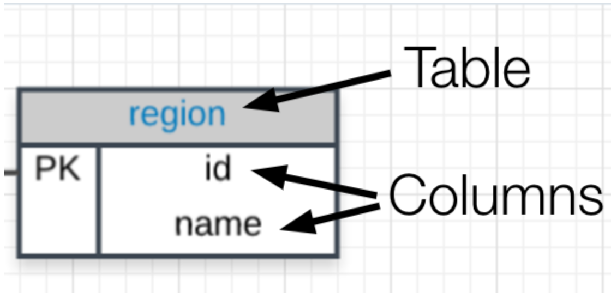
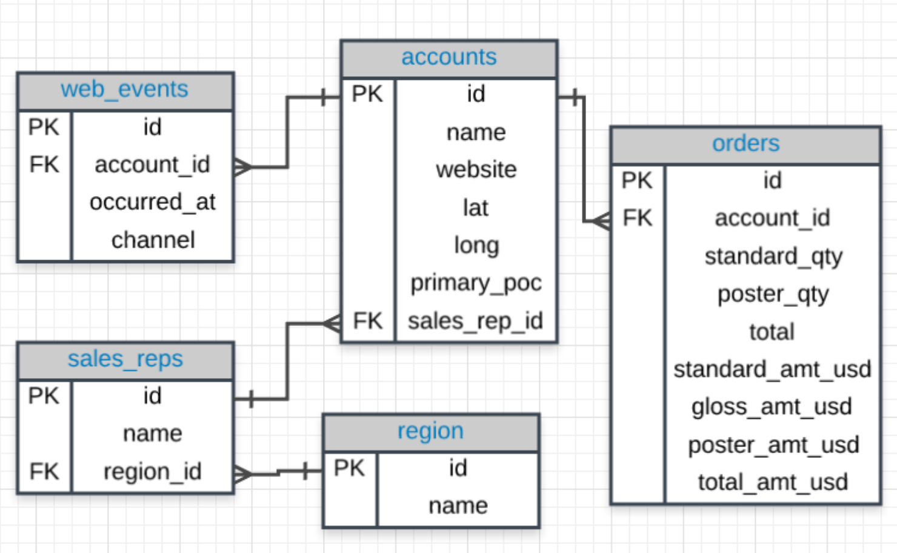

# Basic SQL.

One way to store data is to use spreadsheets. To visualize the relationships between spreadsheets using **ERD** (Entity Relationship Diagram). Each spreadsheet is represented on a table. At the top is a name of the table, below each column name is listed. For example:

SQL is a language used to interact with a database. It can query one table or across multiple tables.

Database is a collection of tables that share connected data tored in a computer.

Below is the ERD for the database we will use from Parch & Posey. These diagrams help you visualize the data you are analyzing including:

1. The names of the tables.
2. The columns in each table.
3. The way the tables work together.
4. You can think of each of the boxes below as a spreadsheet.

Note: glossy_qty is incorrect, it is actually gloss_qty in the database

# Why SQL?

**SQL** has a variety of functions that allows to read, manipulate and change data. Why **SQL** is so popular for data analyses:

1. **SQL** is easy to understand and learn.
2. Access data directly.
3. Easy to audit and copy data.
4. **SQL** can run queries on multiple tables at once, across large datasets.
5. You can do: sum, count, max, min..
6. **SQL** is flexible compare to Google Analytics and Excel.

**NoSQL** stands for not only **SQL**. **NoSQL** envirenments popular for web based data, but less popular for data that lives in spreedsheets.

One of the most popular **NoSQL** database is **MongoDB**. Instead of storing data in tables made out of individual rows, like a relational database does, it stores data in collections made out of individual documents.

## Why Businesses like Databases?

1. Data integrity is ensured - only the data you want entered is entered, and only certain users are able to enter data into the database. 
2. Data can be accessed quickly - SQL allows you to obtain results very quickly from the data stored in a database. 
3. Data is easily shared - multiple individuals can access data stored in a database, and the data is the same for all users allowing for consistent results for anyone with access to your database.

## How DB store data?

Data in DB is stored in tables. DB tables can be organized by column, each column must have a `unique name`. All dat in a column must be of the same type (don't mix string, text or numbers). 

Consistent column types are one of the main reasons working with db is fast. 

[Comparison of Relational
 Database](https://www.digitalocean.com/community/tutorials/sqlite-vs-mysql-vs-postgresql-a-comparison-of-relational-database-management-systems)