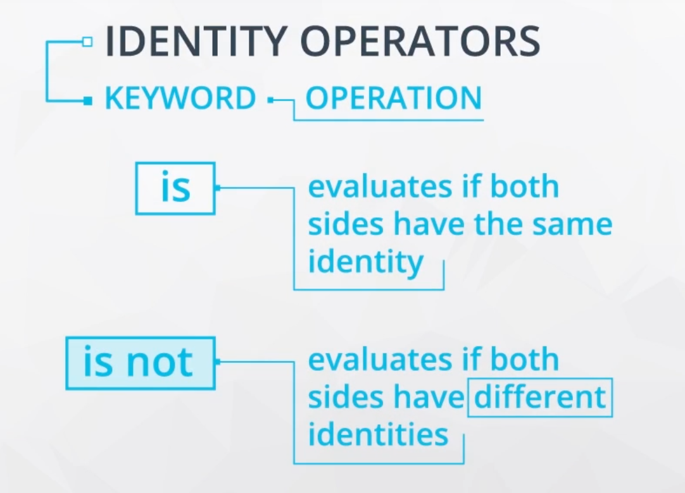

# Dictionary.

A dictionary is a mutable data type. In a list, the indices have to be integers; in a dictionary they can be (almost) any type.

A dictionary stores pairs of elements **keys** and **values**.
We can check whether a value is in a dictionary the same way we check whether a value is in a list or set with the `in` keyword.
`get`is a related method, `get`looks up values in a dictionary and returns `None` if the key is not found or dafault value.
```python
food_bill = {"milk": 2, "bread": 1.23, "apples": 4}

food_bill ["cucumber"] = 1.25 # add element

print(food_bill)
print("tomatoes" in food_bill)
print(food_bill.get("pear")) # return None

# use is not to check if a key return None
vegetables = food_bill.get("carrots")
is_null = vegetables is None # or use: vegetables is not None
print(is_null)
```



```python
elements.get('dilithium')
None

elements['dilithium']
KeyError: 'dilithium'

elements.get('kryptonite', 'There\'s no such element!')
"There's no such element!"
```

# Compound Data Structure.

We can include containers in other containers to create compound data structures.
Nested dictionary: 
```python
elements = {"hydrogen": {"number": 1,
                         "weight": 1.00794,
                         "symbol": "H"},
              "helium": {"number": 2,
                         "weight": 4.002602,
                         "symbol": "He"}}
print(elements['hydrogen'])
print(elements['hydrogen']['number'])
print(elements.get('zink', 'There is no such element!'))

``` 
Python practice links:                  
[More practice](https://www.hackerrank.com/domains/python/py-introduction)
[Python practice](https://www.codewars.com/users/sign_in)     