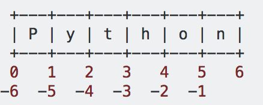
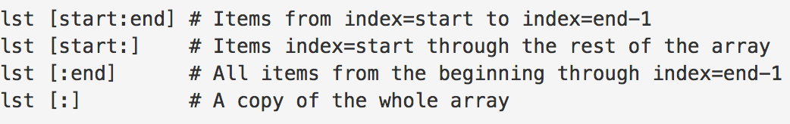
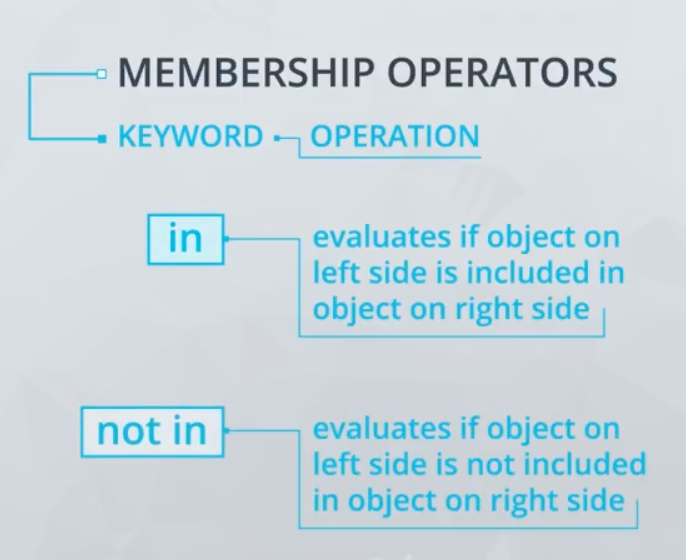

# String Methods.

* String is a sequences of letters.
* Using methods is almost the same as using function: it takes arguments and returns a value. 
* To call method use dot notation. For example `sample_string.lower()`, methods could receive additional arguments, which are passed inside the parentheses.
* Methods are specific to the data type for a particular variable. So there are some built-in methods that are available for all strings, different methods that are available for all integers, etc.

Links:

* [String Methods Documentation](https://docs.python.org/3/library/stdtypes.html#string-methods)

# Lists!

A list is a sequence of values. The values in a list are called **elements** (sometimes **items**) and elements can be any type of data. For example:

`random_list = ['Gauda is a cheese?', 32, True]`

`random_list[-1]`  # True

`random_list[0]`  # Gauda is a cheese?

A list within another list is **nested** list. A list that contains no elements inside is called an **empty** list, for example: []
Lists are mutable (their content can be modified).

# Slicing, in or not in.

Slicing is used to create new lists that have the same values or parts of the values of the originals.

When using slicing, it is important to remember that the lower index is `inclusive` and the upper index is 
`exclusive`. 

# Mutability and oder.

While lists are mutable and can be modified but strings (strings is an immutable data type) don't. Both strings and lists are ordered. 