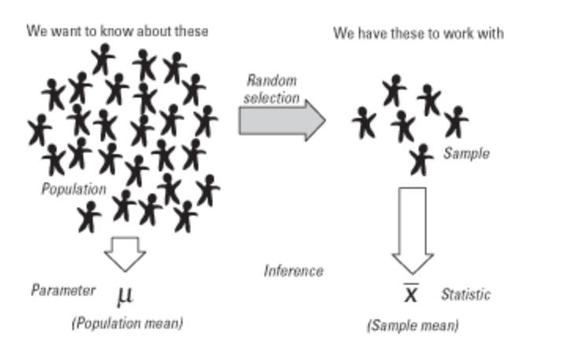
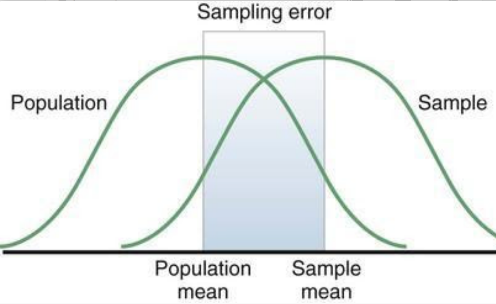

# Constructs, Variables, Operational definition.

**Construct** is a variable that is not directly observable or measurable. But once a construct has been operationally 
defined, variables are created. Examples of Construct: effort, itchiness, hunger, maturity, wisdom...

|Construct      |       Operational definition            |
|   :---:       |                  :---:                   |
|`Stress`       |       Level of cortisol (stress hormone) |
|`Hunger`       |       Gramms of food consumed            |
|`Effort`       |       Minutes spent studying for an exam |

**Operational definition** describes how researcher decide to measure the variables (in our case construct) in a study. It also
  helps you to measure constructs in the real world by turning them into measurable variables 

**Hypothesis** is a statementabout the relationship between the variables.

All experiments/researches examine some kind of variable(s). A variable is not only something that we measure, but also something that we can manipulate and something we can control for.

1. Dependent Variable or Outcome, or y-variable.
  - Is a variable that is dependent on an independent variable(s).

2. Independent Variable sometimes called Experimental Variable or Manipulated Variable, or Predicted, or x-variable.
  - Is a variable that is being manipulated in an experiment in order to observe the effect on a Dependent Variable, sometimes called an Outcome Variable.

3. Lurking Variables or Extraneous factors are variables/factors that can impact the Outcome/Dependent Variable.

# Sample, population.

**Population (or mu)** are values that describe the entire population. 
A `parameter` is any numerical quantity that characterizes a given population or some aspect of it. This means the parameter tells us something about the whole population. Example of parameters: standard deviation, population mean (average)
`N` is a population size.
`mu` is an average (or a mean) of the entire population.

**Sample (or X-bar)** are portions of a population selected for the study. A measurable characteristic of a sample is called a `statistic`.
`n` is a number of a sample.
X-bar is an sample average (or a mean)  of the population.

# Sampling designs.

**Random sample** means that each element in the population has an equal chance of being included to the sample. 

**Random selection (or sampling)** is a randomly choosing a sample from a population.

**Convenience selection (or sampling)** selections is based on easy availability/accessibility of elements; doesn't represent entire population

# Sampling error.

**Samplig error** the difference between a population parameter and a sample statistic used to estimate it. Sampling error occurs because a portion, and not the entire population, is surveyed.

Sampling error formula:
- `mu - X-bar` or `X-bar - mu` where `mu` is a population average and `X-bar` is a sample average

# Bias.

Bias - any systematic failure of a sample to represent its population. 
The most common is called a **simple random bias**. The best way to avoid random bias is to select elements for the sample at random. 
**Non-response bias** occurs when individuals randomly sampled for a survey fail to respond, cannot respond or decline to participate.

Links:
- [Samplig error][1]
- [Estimation of a population][2]
- [OpenIntro Statistics Second Edition by Christopher D. Barr, David M. Diez, and Mine Çetinkaya-Rundel][3]

[1]: https://www.britannica.com/science/sampling-error
[2]: https://www.britannica.com/science/statistics/Estimation-of-a-population-mean#ref367452
[3]: https://www.openintro.org/stat/textbook.php?stat_book=os