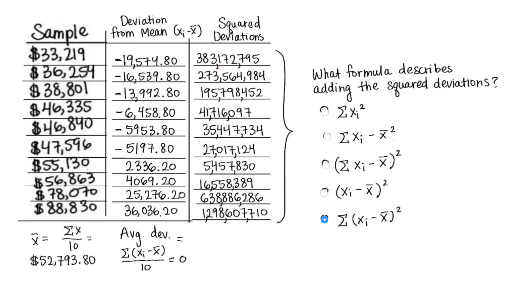
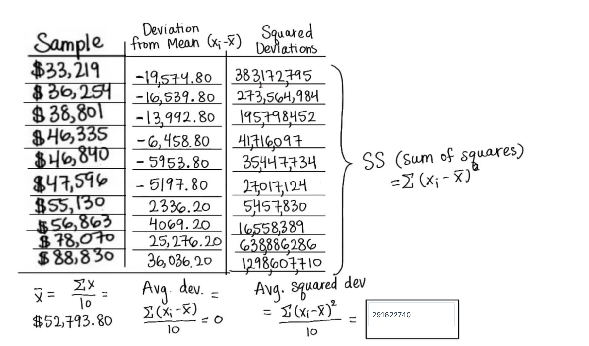

### 24. Which formula describes Average Absolute Deviations:

### 26. Sum of Squres

Another way to get rid of negative values is to squared each one. It means, to multiply each value by itself.

The last correct formula is called **SS - sum of squares**.

### 27. Average Squared Deviation

The average score diviation is 291,622,740. There's a special name for this number, it's called the **variance**.